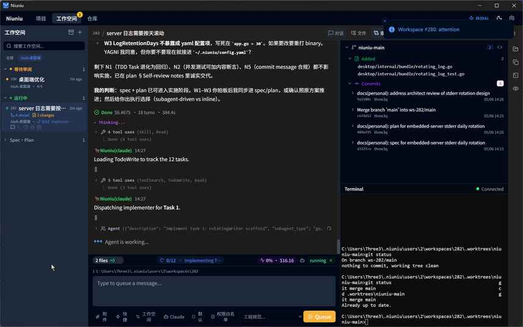

<div align="center">

# 🐮 Niuniu

### Set one goal — an AI team finishes it in parallel

> [中文](./README.md) | English

[](https://github.com/threeq/niuniu-public/stargazers)
[](https://github.com/threeq/niuniu-public/releases/latest)
[](https://github.com/threeq/niuniu-public/releases)
[](./LICENSE)
[](https://www.niu6ai.com/en)
[](https://www.niu6ai.com/en)

</div>

Niuniu is a **goal-driven**, local-first AI work platform: write the work down
as issues, and many agents plan, **execute in parallel**, and self-verify on
**Claude Code / Codex / any model** — across projects and repositories. They
only come back to you when they're actually blocked. It began as a way to drive
many coding agents in parallel and now spans **software development, everyday
office work, data analysis, and content creation**.

## 🎬 Demo

Turn single-session Claude Code (one chat you drive, even with parallel subagents) into **many
workspaces running agents side by side**:

<div align="center">


<sub>Three workspaces each drive their own issue — agents run in parallel, isolated from each other, and wrap up on their own schedule</sub>

<sub><i>Illustrative animation (not a desktop-app screen recording); a real screenshot is below. Generated by <a href="./scripts/make-demo-gif.py"><code>scripts/make-demo-gif.py</code></a>.</i></sub>

</div>

> Real workstation screenshot:
>
> 

## ⚡ Niuniu vs. single-session Claude Code / Cursor

|  | 🐮 Niuniu | Single-session Claude Code / Cursor |
|---|---|---|
| **Unit of work** | A **goal / issue** | A single chat |
| **Concurrency** | **Many workspaces** running agents in parallel | One session you drive, can spawn parallel subagents |
| **Isolation** | Each workspace = its own git worktree + session, no collisions | Shared workspace, easy to step on itself |
| **Autonomy** | Plans → executes → verifies on its own; pings you only when blocked | You babysit every step |
| **Cross-project / repo** | Native, scheduled from one board | Manual context switching |
| **Tracking** | Built-in kanban: issues / checklists / comments / timeline | Scattered across chat history |
| **Execution flow** | AI auto-selects the flow from your kanban stages (implement / AI review / human review / done) | Fixed manual steps |
| **State access** | Claude Code reads Niuniu context directly over MCP | None |

> In one line: Claude Code / Cursor — even with parallel subagents — is still **one session you drive**; Niuniu is the
> workstation that schedules **many independent workspaces, each with its own team of agents**, from a board.

## ✨ Capabilities

One platform across software · office · data · content:

- **Goal-driven, self-hosted loop** — write a goal; the agent plans → executes → verifies → wraps up. An auto-host watchdog keeps pushing unattended and only returns when blocked.
- **Parallel workspaces, worktree isolation** — each workspace gets its own git worktree + agent session, running across projects and repos without collisions.
- **Multi-engine, any model, no lock-in** — drive Claude Code / Codex / Qwen Code, or point a scene at GLM / DeepSeek / MiniMax / Kimi and any compatible endpoint, switchable per workspace.
- **Kanban + Harness engineering gates** — track issues / checklists / comments / timeline in one place; Harness wires lint / tests / AI review into pre-commit gates.
- **Scenes: one-click work modes** — 18 built-in scenes across software / office / data / content, declaratively injecting MCP servers + plugins + slash commands.
- **Data intelligence** — connect SQL / Redis / Mongo / ES / HTTP, run governed read-only queries, inline charts, and pin them as live-refreshing dashboards.
- **Knowledge base + project memory** — ingest local directories into a searchable knowledge base; white-box project memory captures patterns, decisions, and pitfalls.
- **IM bots: Lark / DingTalk / Telegram** — drive work conversationally from group chats, images in, markdown out, one bot fanning out across projects.
- **Unattended scheduled execution** — attach cron schedules to a workspace to trigger agents automatically, with replayable run history.

## Links

- 🌐 Website & docs: <https://www.niu6ai.com/en>
- 📦 Desktop app downloads: [Releases](https://github.com/threeq/niuniu-public/releases/latest)
- 📝 Blog: <https://www.niu6ai.com/blog>
- 📜 Changelog: <https://www.niu6ai.com/en/changelog>
- 🐛 File a bug: [New Bug Report](https://github.com/threeq/niuniu-public/issues/new?template=bug_report_en.yml)
- 💡 Feature request: [New Feature Request](https://github.com/threeq/niuniu-public/issues/new?template=feature_request_en.yml)

## About Niuniu

This public repository contains the official website source, desktop app
releases, issue tracking, and community feedback. The application source lives
in a private repository. See the [official site](https://www.niu6ai.com/en) for
the full overview.

Niuniu raises the unit of work from "a chat" to "a goal." Each workspace maps to
one issue and comes with its own isolated git worktree, its own Claude session,
and its own shell environment. The agent autonomously closes the loop on that
goal — and multiple workspaces run in parallel without interfering with each
other.

## Notes on filing issues

- Issues here are triaged by the maintainers, but the **fix lands in the
  private repository**, so closing the issue may lag behind the actual fix.
- For **security issues** (vulnerabilities, data leaks, etc.), do **not** file
  publicly — email the maintainer via the contact info on the website.
- When filing a bug, include the desktop app version, OS, and reproduction
  steps; the templates will walk you through it.

## Official Website

The website source lives in the [`website/`](./website/) directory of this
repo, built with [Astro](https://astro.build/) and deployed to
[www.niu6ai.com](https://www.niu6ai.com/en).

Local development:

```bash
cd website && pnpm install && pnpm dev
```

Deploy to production:

```bash
bash deploy.sh
```

## License

[MIT](./LICENSE)
